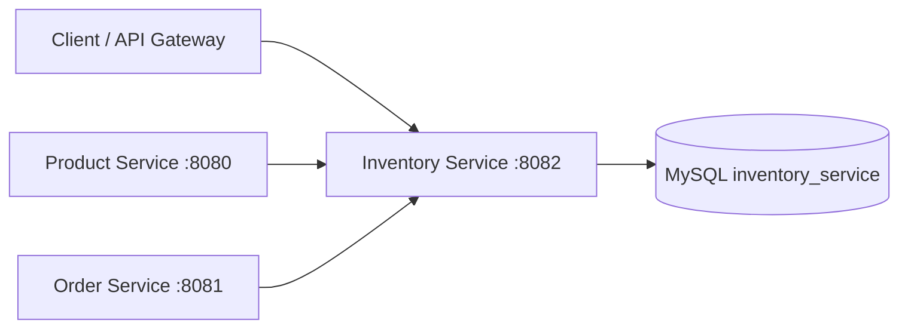

# Inventory Service

Inventory microservice for the Spring Shop microservices platform. It manages stock, warehouses and inventory movements, and persists inventory data in MySQL.

## Responsibilities

- Create and query inventory records.
- Manage stock quantities.
- Track inventory movements.
- Manage warehouse information and warehouse status.
- Provide synchronous stock operations for other services such as Product Service and Order Service.
- Maintain database schema through Flyway migrations.

## System Design



### Request flow

1. Product or Order Service calls Inventory Service when inventory information is required.
2. Inventory Service executes business logic in the service layer.
3. JPA repositories access MySQL.
4. Flyway applies versioned database migrations at startup.
5. Inventory and movement data remain owned by this service.

## Technology Stack

- Java 21
- Spring Boot 3.5.0
- Spring Web MVC
- Spring Data JPA
- MySQL
- Flyway
- Lombok
- Testcontainers
- Maven

The Maven configuration confirms JPA, MySQL, Flyway and Testcontainers dependencies. fileciteturn8file0L2-L2

## Project Structure

```text
inventory-service/
├── src/main/java/com/example/inventory_service/
│   ├── controller/
│   │   └── InventoryController.java
│   ├── dto/
│   │   └── InventoryCreateRequest.java
│   ├── model/
│   │   ├── Inventory.java
│   │   ├── InventoryMovement.java
│   │   ├── Warehouse.java
│   │   └── Enums/
│   │       ├── MovementType.java
│   │       └── WarehouseStatus.java
│   ├── repository/
│   │   └── InventoryRepository.java
│   └── service/
│       └── InventoryService.java
├── src/main/resources/
│   ├── application.properties
│   └── db/migration/
│       ├── V1__init.sql
│       └── V2__Warehouse.sql
├── mysql/init.sql
├── docker-compose.yml
├── pom.xml
└── README.md
```

The repository currently contains separate controller, DTO, model, repository and service layers, plus two Flyway migrations. fileciteturn24file0L2-L2

## API

The exact endpoint definitions are implemented in `InventoryController`. The service runs on port `8082`. fileciteturn13file0L2-L2

Typical responsibility of the API is stock lookup and inventory management for product/order workflows.

## Database

Database: `inventory_service`

Default local connection:

```text
jdbc:mysql://localhost:3307/inventory_service
```

Username: `root`

Password: `root`

Hibernate schema generation is disabled (`ddl-auto=none`) because schema management is handled by Flyway. fileciteturn13file0L2-L2

### Migrations

- `V1__init.sql` initializes the inventory schema.
- `V2__Warehouse.sql` adds warehouse-related schema.

## Local Development

### Prerequisites

- JDK 21+
- Docker / Docker Compose
- Maven or Maven Wrapper
- MySQL

### Start MySQL

```bash
docker compose up -d
```

### Run

```bash
./mvnw spring-boot:run
```

Windows:

```powershell
.\mvnw.cmd spring-boot:run
```

### Test

```bash
./mvnw clean test
```

## Architecture Notes

- Inventory is a separate bounded service with its own MySQL schema.
- Other services communicate through HTTP rather than directly accessing the inventory database.
- Persistence is isolated behind repositories.
- Business rules belong in `InventoryService` rather than controllers.
- Flyway provides repeatable, versioned database evolution.
